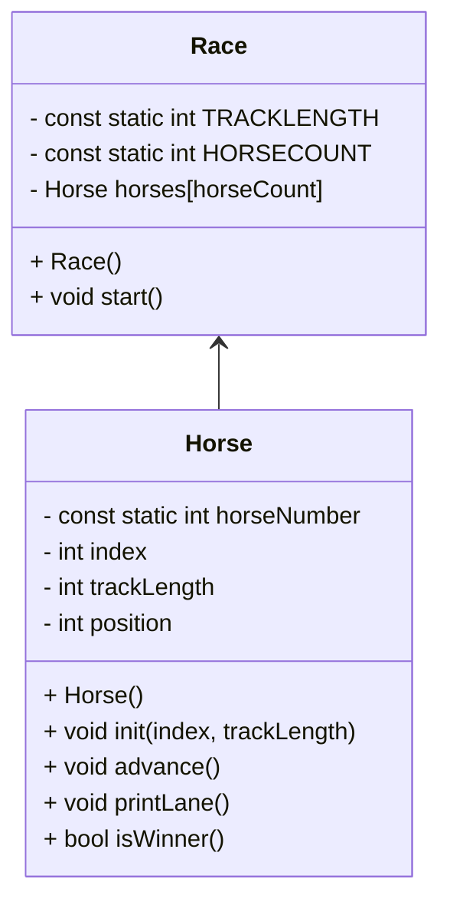

# Diagram and Algorithm for Lab 4, OOP Horse Race

## Mermaid Diagram



## Method Algorithms

### Race::Race()
```
const int trackLength
const static int HORSECOUNT
Create an array of horses length HORSECOUNT
Initialize all horses
For each horse
  Initialize horse with index and track length
```

### Race::start()
```
bool(keepGoing)
Seed randomizer
while(keepGoing):
  for horse in horseArray:
    Advance the horse
    Print the lane
    If the horse is the winner:
      Run isWinner()
```

### Horse::Horse()
```
int position
int index
int trackLength
```

### void Horse::init(int index, int trackLength)
```
Horse::index = index
Horse::trackLength = trackLength
Horse::position = 0
```

### void Horse::advance()
```
int movement
Roll a number between 0 and 1 and put it in movement
Add movement to position
'''


### void Horse::printLane()
```
For distance of lane:
  if Sentry == current position:
    print Horse::index
  else:
    print "."
  print Newline
```

### bool Horse::isWinner()
bool winning = false
if position >= trackLength:
  winning = true
  print A victory message
return winning
```


